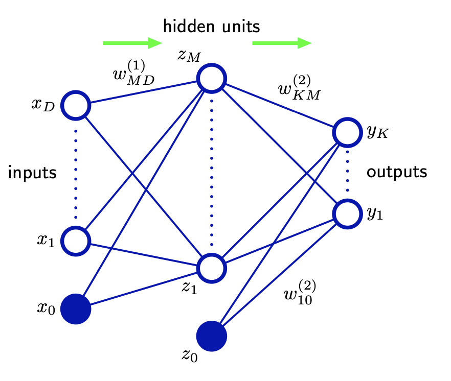
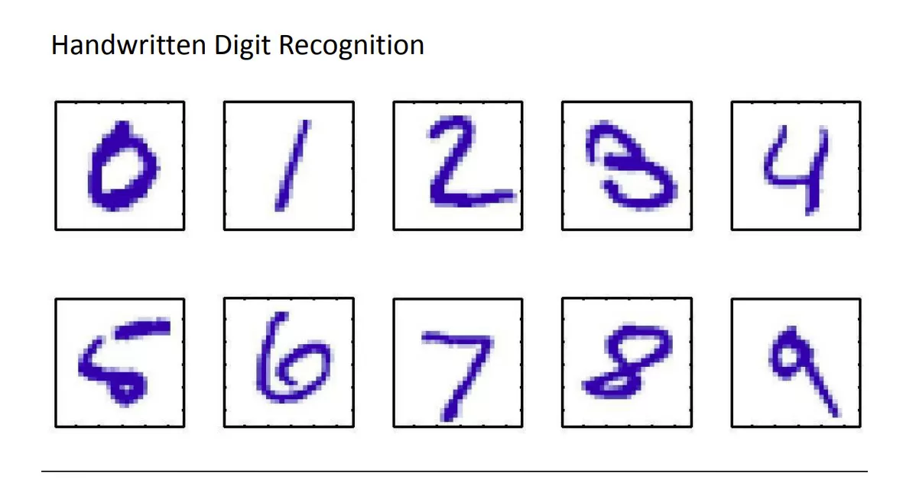
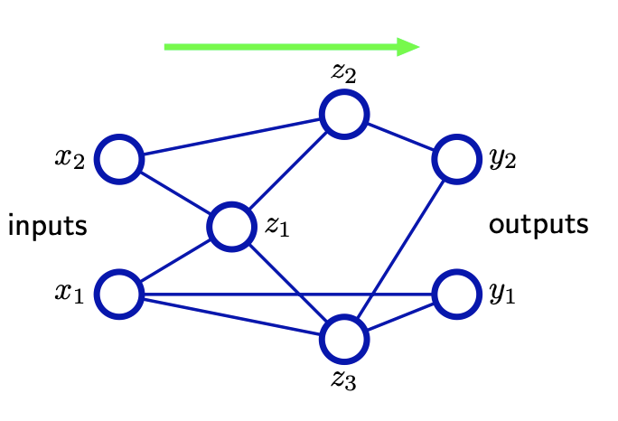
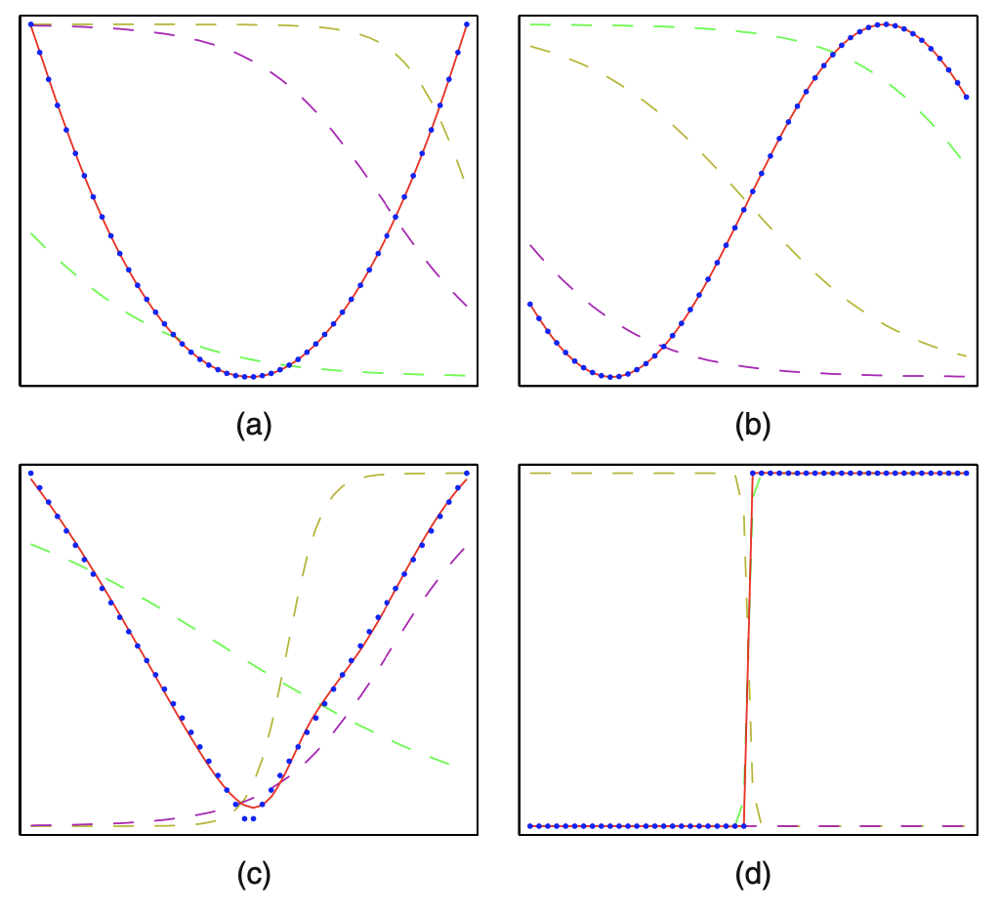
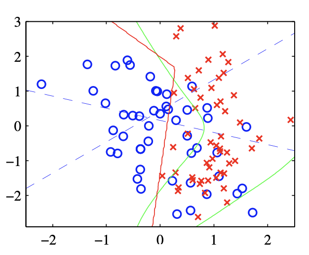

## 05 : Neural Networks
### 05-01 : Feed-forward Network Functions
p.227~

---
### 05-01-00 : Overview

ニューラルネットワークの概要について全体像を扱う.

---
### 線形モデル

回帰および分類のための線形モデルは, それぞれ固定の非線形基底関数 $\varphi_{j}(x)$ の線形結合に基づいており, 以下の形式を取った.
これを基本として, ニューラルネットワークについても考える.

$$
y(\bm{x},\bm{w}) = f\left( \sum_{j=1}^M w_j \varphi_{j}(\bm{x})\right) \dots (5.1)
$$

$\bm{x}$ : D次元の入力ベクトル
$\bm{w}$ : M次元の重みベクトル(バイアスを含めない)
$\varphi_{j}(\bm{x})$ : 基底関数
$f$ : 分類の場合は非線形活性化関数, 回帰の場合は恒等式

---
#### ※基底関数 (basis functions) $\varphi_{j}(\bm{x})$ について

これまでは, 基底関数として多項式基底 $\varphi_{j}(x)=x^i$ を用いていた.

$$
y(\bm{x},\bm{w}) = w_1x_1 + w_2{x_2}^2 + w_3{x_3}^3 + \ldots
$$

他にはガウス基底などがある.
目標は, 基底関数と重みと重みを調整することで, このモデルを作成していくことである.

---
### two-layer neural network

*Figure 5.1*

$x_i$ を入力層, $z_i$ を隠れユニット (hidden units) , $y_i$ を出力層と呼ぶ.

---
### 出力層の次元について (補足)

<!-- CHECK:他の事例もあれば補足 -->
手描き文字の認識の場合は出力が0~9のそれぞれの数字に対応する確率になる.

---

まず, 入力変数 $x_1, \ldots x_D$ の $M$ 個の線形結合を次のような形式で構築する. $a_j$ をactivations と呼ぶ. 上付き文字の $(1)$ はネットワークの層(layer)である.

$$
a_j = \sum_{i=1}^D w_{ji}^{(1)}x_i + w_{j0}^{(1)} \dots (5.2)
$$

$i = 1,2,\ldots , D$ であり, 入力の次元数を指す.
$j = 1,2,\ldots , M$ であり, activation のインデックス(中間層の次元数)を指す.
$w_{ji}$ を重み, $w_{j0}$ をバイアスと呼ぶ.

$a_j$ は微分可能 (重みの決定に勾配を用いたい) な非線形活性化関数 $h$ を使って変換され, 次のようになる.

$$
z_j = h(a_j) \dots (5.3)
$$

---

この非線形活性化関数 $h$ には, 一般的にロジスティックシグモイド関数や $\tanh$ が選ばれる.

※ $\tanh$ (双曲線正接関数) は以下のような関数.
$$
\tanh(x) = \frac{e^x-e^{-x}}{e^x+e^{-x}}
$$

$(5.1)$ に従い, これらの値は再び線形結合され, 次の入力になる.

$$
a_k = \sum_{j=1}^M w_{kj}^{(2)}z_j + w_{k0}^{(2)} \dots (5.4)
$$

$k = 1,2,\ldots , K$ であり, 出力のインデックスを指す.
※ $a_k$ は上の $a$ と異なるので, 本来は上付き文字などをつけるべき.

---

最後に, 適切な活性化関数を用いて出力ユニットの活性化を変換し, 出力 $y_k$ を与える.

第3, 4章の結果を用いて活性化関数は決定する. 5.2章でこの活性化関数の選択に関する内容を扱う.

$$
y_k = \sigma (a_k) \dots (5.5)
$$

- 標準回帰問題 : $y_k = a_k$ となる恒等式
- 多重二値分類問題 : ロジスティック・シグモイド関数
- 多クラス分類問題 : ソフトマックス活性化関数

---
※多重二値分類問題で用いるロジスティック・シグモイド関数
<!-- TODO:関数の性質を追記-->
$$
\sigma (a) = \frac{1}{1+\exp(-a)} \dots (5.6)
$$

※多クラス分類問題で用いるソフトマックス活性化関数 (p.198より)
$$
p(C_k|\bm{x}) = \frac{\exp(a_k)}{\sum_{j} \exp(a_j)} \dots (4.62)
$$

---

最終的な出力として, 活性化関数にロジスティック・シグモイド関数を選ぶと以下のような結果になる. ( $(5.2)-(5.5)$ の計算結果をまとめたもの)

$$
y_k(\bm{x}, \bm{w}) = \sigma \left( \sum_{j=1}^M w_{kj}^{(2)} h \left( \sum_{i=1}^D w_{ji}^{(1)}x_i + w_{j0}^{(1)} \right) + w_{k0}^{(2)} \right) \dots (5.7)
$$

$w_{j0}, w_{k0}$ のバイアスをを $\bm{w}$ に含めることで, 以下のように書き換えることができる.

$$
y_k(\bm{x}, \bm{w}) = \sigma \left( \sum_{j=0}^M w_{kj}^{(2)} h \left( \sum_{i=0}^D w_{ji}^{(1)}x_i \right) \right) \dots (5.9)
$$

※ $w_{00}$ は存在しないことに注意する必要がある. しかし, $z_{j0}$ は1でないといけない.

<!-- ※ $a_j = \sum_{i=0}^D w_{ji}^{(1)}x_i \ldots (5.8)$ を2層目に関しても同様に行う. -->

---
#### $\bm{w}$ の要素について

$\bm{w}$ は行列の列である. $\bm{w}$ の要素は $w$ の右上に上付き数字 $n$ ( $n$ は1以上の自然数) をつけたもので表現されており, $n$ 層目から $n+1$ 層目の変換に用いる行列を指す.
$w^{(n)}$ は $n$ 層目のアクティベーションの数が列数となり, $n+1$ 層目のアクティベーションの数(最後は出力の数)が行数になる. $\bm{w}$ の各行列の行数と列数は同じと限らない.
$w^{(1)}, w^{(2)}$ は以下のような行列となる.

$$
w^{(1)} =
\begin{bmatrix}
  w_{10}^{(1)} & w_{11}^{(1)}  & \dots  & w_{1D}^{(1)}  \\
  w_{20}^{(1)}  & w_{21}^{(1)}  & \dots  & w_{2D}^{(1)}  \\
  \vdots & \vdots & \ddots & \vdots \\
  w_{M0}^{(1)}  & w_{M1}^{(1)}  & \dots  & w_{MD}^{(1)}
\end{bmatrix}
,
w^{(2)} =
\begin{bmatrix}
  w_{10}^{(2)} & w_{11}^{(2)}  & \dots  & w_{1M}^{(2)}  \\
  w_{20}^{(2)}  & w_{21}^{(2)}  & \dots  & w_{2M}^{(2)}  \\
  \vdots & \vdots & \ddots & \vdots \\
  w_{K0}^{(2)}  & w_{11}^{(2)}  & \dots  & w_{KM}^{(2)}
\end{bmatrix}
$$

---
### パーセプトロンモデルとの違い

- perceptron algorithm : $y(x) = f(\bm{w}^T \phi(\bm{x})) \dots (4.52)$
- neural network : $y_k(\bm{x}, \bm{w}) = \sigma \left( \sum_{j=0}^M w_{kj}^{(2)} h \left( \sum_{i=0}^D w_{ji}^{(1)}x_i \right) \right) \dots (5.9)$

perceptron algorithm で用いる $f$ はステップ関数であり, 非線形で微分できない.
一方, neural network で用いる $\sigma$ はシグモイド関数であり, 連続で微分もできる.

すべての隠れユニットの活性化関数が線形である場合, 常に隠れたユニットのない同等のネットワークを見つけることができる. これは, 連続する線形変換の合成が線形変換であるという事実から従う. ただし, 隠れユニットの次元数が入力ユニットまたは出力ユニットよりも小さい場合, 隠れユニットでの次元削減において情報が失われ, 最も一般的な線形変換にはならない. **つまり, 線形だとニューラルネットワークの意味がない.**

---

### two-layer neural network について (補足)

1. これは簡単に追加の層を追加して拡張がするできる. (層の数について一般化できる)
2. ネットワークの層数を数える際の用語については文献よって差異がある. 今回扱っている2層ネットワークについても, 出力層と入力層を含めて3層ネットワークと数えている文献もある. しかし, 重みの層の数である ( $w$ の上付き数字とも一致する) ため, 2層ネットワークという用語を本書ではお勧めする.

---
### skip-layer connections, sparse network

ネットワークアーキテクチャの別の一般化で, skip-layer connections を含めることがある.

*Figure 5.2*

---

例えば, 前ページの図の $x_1$ から $y_1$ を結ぶ線分のように2層ネットワークで直接入力から出力に向かうものを skip-layer connections という. これは十分に小さな1層目の重みを用意することで今までのような2層のモデルでも模倣することができるが, 実際には skip-layer connections を用いた方が有利な場合がある.

また, sparse (疎) なネットワークを扱う場合もある.
これは, 各層のユニットが全ての他のユニットと接続されているのではなく, 一部のユニットのみが接続されている状態を指す.
Section 5.5.6で畳み込みニューラルネットワークを考える際に扱うことになる.

---

skip layer connections や　sparse network も含めてより一般的なネットワーク図に関して数学的に考えたいが, これらは **feed-forward** である必要がある.

feed-forward とは, 閉じた有向サイクルがなく, 出力が入力の決定的な関数であるということである. これは5.2のような状態である.
5.2のようなネットーワークの隠層のユニットは以下のような計算を行うことになる.

$$
z_k = h \left( \sum_{j} w_{kj}z_j \right) \dots (5.10)
$$

ネットワークの入力に適用される値の与えられたセットに対して, $(5.10)$ の連続的な適用により, ネットワーク内のすべてのユニットの活性化を評価することができる. これには出力ユニットも含まれる.

---

フィードフォワードネットワークの近似特性は広く研究されており, 例えば線形出力を持つ2層のネットワークは, ネットワークが十分な数の隠れユニットを持っている場合, コンパクトな定義域をもつ連続関数を任意の精度で一様に近似できる.

2層のネットワークがモデル化する能力を, 以下で示している. ( *Figure 5.3* *Figure 5.4* )

*Figure 5.3* について

$a:f(x) = x^2, b:f(x) = \sin(x), c:f(x) = |x|, d:f(x) = H(x)$ (ここで, $H(x)$ はステップ関数).

青い点 : $N = 50$ のデータポイント 区間 $(-1, 1)$ で一様にxにサンプリングされる.
赤い曲線 : ネットワークの出力
破線 : 3つの隠れユニットの出力

---

*Figure 5.3*

---

*Figure 5.4*

---
### 05-01-01 : Weight-space symmetries

重み空間の対称性について扱う.
※ この部分は $\bm{w}$ の扱いについて間違えていると思われる.
$M$ がアクティベーションの総数なのか層の数なのか混同している. ただ, あまり重要でないために修正は今後時間がある時に行うこととし, ここでは重みの対称性があり等価な重みベクトルが複数存在するということを認識するに留める.

---
### 重み空間対称性

M個の隠れユニットが $\tanh$ 活性化関数を持っているとする.

ある特定の隠れユニットのすべての重み $w^{(i)}$ の符号を変更したとすると, $\tanh(-a_k) = -\tanh(a_k)$ が成立し, この隠れユニットからの重みは反転する. これは $\tanh$ が奇関数であるためである.

この変換は, その隠れユニットの出力 $z^{(i)}$ にかかる重み $w^{(i+1)}$ の符号を全て反転することで保証できる.

つまり, 符号の観点から見て, 任意の重みベクトルは $2^M$ 通りの同じ結果を生み出すベクトルの1つであることがわかる.

---

同様に, 特定の隠れユニットのすべての重みの値を, 異なる隠れユニットの重みの値と入れ替えることを考える. (行を入れ替える)
これはネットワーク全体の出力を変化させない.
よって, $M$ 個の重みベクトルの順列として $M!$ 通りの等価な重みベクトルがあると考えられる.

よって, 先の結果と合わせることで, あるネットワークには $2^MM!$ 通りの等価な重みベクトルが存在することがわかる.

これらの対称性の存在は $\tanh$ の特性ではなく, 広範な活性化関数に適用されることがわかっている. (Ku ̇rkova ́ and Kainen, 1994)

これが, 重み空間の対称性であり, 実用上あまり重要ではないが第5.7節ではこれらを考慮する必要がある状況に遭遇する.