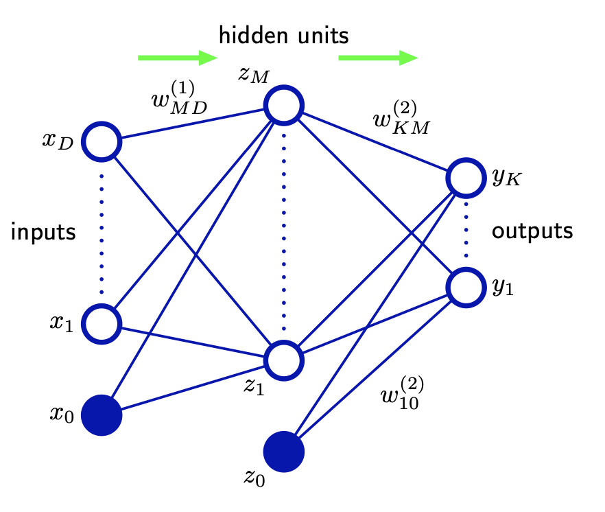

## 05 : Neural Networks
### 05-01 : Feed-forward Network Functions
---
### 線形モデル

回帰および分類のための線形モデルは, それぞれ固定の非線形基底関数 $\varphi_{j}(x)$ の線形結合に基づいており, 以下の形式を取る.

$$
y(\bm{x},\bm{w}) = f\Bigg( \sum_{j=1}^\infty w_j \varphi_{j}(\bm{x})\Bigg) \dots (5.1)
$$

$\bm{x}, \bm{w}$ : D次元の入力ベクトルと重みベクトル(バイアスを含めない)
$\varphi_{j}(\bm{x})$ : 基底関数
$f$ : 分類の場合は非線形活性化関数, 回帰の場合は恒等式

---
### 基底関数 $\varphi_{j}(\bm{x})$ について

これまでは, 基底関数として多項式基底 $\varphi_{j}(x)=x^i$ を用いていた.

$$
y(\bm{x},\bm{w}) = w_1x_1 + w_2{x_2}^2 + w_3{x_3}^3 + \ldots
$$

他にはガウス基底などがある.
目標は, 基底関数と重みと重みを調整することで, このモデルを作成していくことである.

---
### two-layer neural network

---

まず, 入力変数 $x_1, \ldots x_D$ の $M$ 個の線形結合を次のような形式で構築する. $a_j$ をactivations と呼ぶ. 上付き文字の$(1)$はネットワークの層(layer)である.

$$
a_j = \sum_{i=1}^D {w_{ji}}^{(1)}x_i + {w_{j0}}^{(1)} \dots (5.2)
$$

$i = 1,2,\ldots , D$ であり, 次元数を指す.
$j = 1,2,\ldots , M$ であり, activation のインデックスを指す.
$w_{ji}$ を重み, $w_{j0}$ をバイアスと呼ぶ.

---

$a_j$ は微分可能な非線形活性化関数 $h$ を使って変換され、次のようになる.

$$
z_j = h(a_j) \dots (5.3)
$$

この非線形活性化関数 $h$ には, 一般的にロジスティックシグモイドや「tanh」関数のようなシグモイド関数が選ばれる.

$(5.1)$ に従い, これらの値は再び線形結合され, 次の入力になる.

$$
a_k = \sum_{j=1}^M {w_{kj}}^{(2)}z_j + {w_{k0}}^{(2)} \dots (5.4)
$$

---

$k = 1,2,\ldots , K$ であり, 出力のインデックスを指す.

最後に, 適切な活性化関数を用いて出力ユニットの活性化を変換し, 出力 $y_k$ を与える。

第3, 4章の結果を用いて活性化関数は決定する. 5.2章でこの内容を扱う.

$$
y_k = \sigma (a_k) \dots (5.5)
$$

- 標準回帰問題 : $y_k = a_k$ となる恒等式
- 多重二値分類問題 : ロジスティック・シグモイド関数
- 多クラス問題 : ソフトマックス活性化関数

---

---

#### ※多重二値分類問題で用いるロジスティック・シグモイド関数

